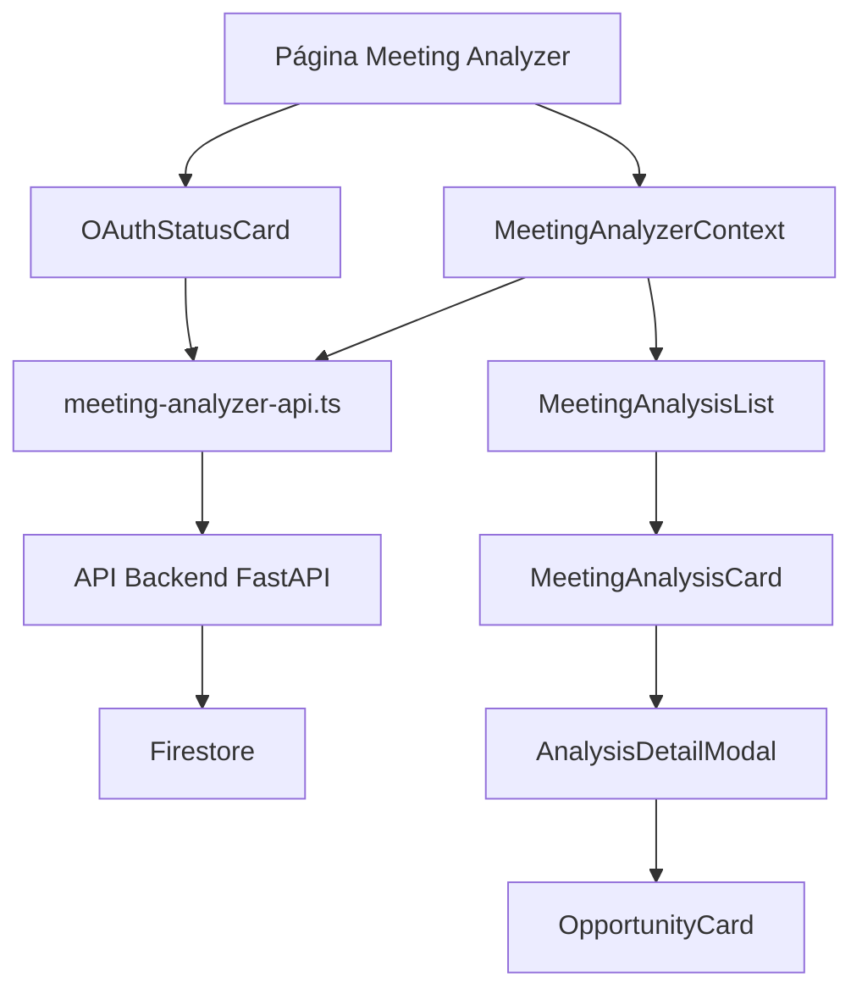

<!-- 503b6e05-dcf3-4a9b-84c1-9e7e9876c8ae e0bc9d6e-5966-4fef-9a79-e7437053c657 -->
# Planejamento - Frontend Meeting Analyzer

## Objetivo

Criar uma página na sidebar que exibe os resultados das análises de reuniões processadas pelo Meeting Analyzer Service, permitindo visualizar histórico, resumos, oportunidades identificadas e gerenciar autenticação OAuth.

## Arquitetura

### 1. Estrutura de Arquivos

```
src/
├── app/(app)/
│   └── meeting-analyzer/
│       └── page.tsx                    # Página principal
├── components/
│   └── meeting-analyzer/
│       ├── MeetingAnalysisList.tsx      # Lista de análises com tabela
│       ├── MeetingAnalysisCard.tsx     # Card de análise individual
│       ├── AnalysisDetailModal.tsx      # Modal com detalhes completos
│       ├── OAuthStatusCard.tsx         # Card de status OAuth
│       └── OpportunityCard.tsx         # Card de oportunidade
├── contexts/
│   └── MeetingAnalyzerContext.tsx       # Contexto para gerenciar dados
└── lib/
    └── meeting-analyzer-api.ts         # Cliente API para backend
```

### 2. Fluxo de Dados



### 3. Implementação

#### 3.1. Cliente API ([src/lib/meeting-analyzer-api.ts](src/lib/meeting-analyzer-api.ts))

Criar cliente para comunicação com a API externa:

- Configurar URL base via variável de ambiente `NEXT_PUBLIC_MEETING_ANALYZER_API_URL`
- Funções para:
  - `getOAuthStatus(email: string)` - Status OAuth
  - `getOAuthAuthorizeUrl(email: string, force?: boolean)` - URL de autorização
  - `revokeOAuth(email: string)` - Revogar autorização
  - `getMeetingHistory(params)` - Histórico de análises (quando endpoint estiver disponível)
  - `analyzeMeeting(file: File)` - Upload e análise de arquivo
- Tratamento de erros padronizado
- Validação de respostas

#### 3.2. Contexto de Dados ([src/contexts/MeetingAnalyzerContext.tsx](src/contexts/MeetingAnalyzerContext.tsx))

Criar contexto seguindo padrão dos outros contextos:

- Usar React Query para cache e sincronização
- Estado para:
  - Lista de análises
  - Status OAuth do usuário
  - Loading states
- Funções:
  - `fetchMeetingHistory()` - Buscar histórico
  - `checkOAuthStatus()` - Verificar status OAuth
  - `requestOAuthAuthorization()` - Solicitar autorização
  - `revokeOAuth()` - Revogar autorização
- Integrar com `AuthContext` para obter email do usuário

#### 3.3. Componentes de UI

**MeetingAnalysisList** ([src/components/meeting-analyzer/MeetingAnalysisList.tsx](src/components/meeting-analyzer/MeetingAnalysisList.tsx)):

- Tabela com colunas: Data, Tipo, Resumo (truncado), Oportunidades, Ações
- Filtros: tipo de reunião, data (range), busca por texto
- Paginação (50 itens por página)
- Ordenação por data (mais recente primeiro)
- Loading skeleton

**MeetingAnalysisCard** ([src/components/meeting-analyzer/MeetingAnalysisCard.tsx](src/components/meeting-analyzer/MeetingAnalysisCard.tsx)):

- Card compacto para visualização em lista
- Badges para prioridade de oportunidades
- Botão para ver detalhes

**AnalysisDetailModal** ([src/components/meeting-analyzer/AnalysisDetailModal.tsx](src/components/meeting-analyzer/AnalysisDetailModal.tsx)):

- Modal com informações completas:
  - Resumo expandido
  - Lista de oportunidades com detalhes
  - Participantes
  - Metadados (tempo de processamento, modelo usado)
  - Link para arquivo original (se disponível)

**OAuthStatusCard** ([src/components/meeting-analyzer/OAuthStatusCard.tsx](src/components/meeting-analyzer/OAuthStatusCard.tsx)):

- Card mostrando status de autenticação OAuth
- Botão para autorizar/revogar
- Indicador visual (verde/vermelho) do status
- Link para autorização quando necessário

**OpportunityCard** ([src/components/meeting-analyzer/OpportunityCard.tsx](src/components/meeting-analyzer/OpportunityCard.tsx)):

- Card individual para cada oportunidade
- Badge de prioridade (high/medium/low)
- Lista de menções do cliente
- Descrição formatada

#### 3.4. Página Principal ([src/app/(app)/meeting-analyzer/page.tsx](src/app/\\\(app)/meeting-analyzer/page.tsx))

Estrutura:

- `PageHeader` com título e descrição
- `OAuthStatusCard` no topo
- `MeetingAnalysisList` como conteúdo principal
- Layout responsivo com padding padrão
- Integração com `MeetingAnalyzerContext`

#### 3.5. Sidebar Navigation ([src/components/layout/AppLayout.tsx](src/components/layout/AppLayout.tsx))

Adicionar item na sidebar:

- Ícone: `Video` ou `Mic` do lucide-react
- Rota: `/meeting-analyzer`
- Label: "Análise de Reuniões"
- Posicionar após "Bob" ou antes de "Store"
- Sem permissão especial (acesso geral)

### 4. Tipos TypeScript

Criar tipos baseados na documentação da API:

```typescript
interface MeetingAnalysis {
  id: string;
  user_email: string;
  space_id: string | null;
  file_id: string;
  file_name: string;
  meeting_type: 'prospeccao' | 'cliente' | 'interna' | 'outro';
  summary: string;
  summary_topics?: string[] | null;
  opportunities: Opportunity[];
  participants: string[];
  assessment?: any;
  gcs_metadata_path?: string | null;
  gcs_metadata_url?: string | null;
  metadata: {
    filename: string;
    file_size?: number;
    chunk_count: number;
    processing_time: number;
    meeting_type: string;
    has_assessment: boolean;
  };
  created_at: string; // ISO 8601
  updated_at: string; // ISO 8601
}

interface Opportunity {
  title: string;
  description: string;
  priority: 'high' | 'medium' | 'low';
  clientMentions: string[];
}

interface OAuthStatus {
  email: string;
  has_valid_tokens: boolean;
  needs_authorization: boolean;
  reason: string;
}
```

### 5. Variáveis de Ambiente

Adicionar em `.env.local` (exemplo):

```
NEXT_PUBLIC_MEETING_ANALYZER_API_URL=https://meeting-analyzer-api-981847244419.us-central1.run.app
```

### 6. Integração com Provider

Adicionar `MeetingAnalyzerProvider` em [src/app/(app)/layout.tsx](src/app/\\\(app)/layout.tsx) seguindo padrão dos outros providers.

### 7. Tratamento de Erros

- Toast notifications para erros de API
- Fallback UI quando não houver dados
- Mensagens amigáveis para erros de OAuth
- Loading states durante requisições

### 8. Segurança

- Validar email do usuário antes de fazer requisições
- Não expor tokens ou dados sensíveis no frontend
- Sanitizar dados recebidos da API
- Validar tipos de arquivo se houver upload

### 9. Responsividade

- Tabela responsiva com scroll horizontal em mobile
- Cards adaptáveis para diferentes tamanhos de tela
- Modal fullscreen em mobile

### 10. Acessibilidade

- Labels adequados para screen readers
- Navegação por teclado
- Contraste adequado nos badges de prioridade

## Notas Importantes

1. **Endpoint de Histórico**: O endpoint `GET /api/meeting/history` ainda não está implementado. O frontend deve estar preparado para isso, mas inicialmente pode buscar dados diretamente do Firestore se necessário, ou exibir mensagem informativa.

2. **OAuth Flow**: O fluxo OAuth requer redirecionamento. Implementar:

   - Verificar status ao carregar página
   - Se não autorizado, mostrar botão que abre URL de autorização em nova aba
   - Após callback, atualizar status

3. **Formato de Datas**: Converter Timestamps do Firestore para ISO 8601 e formatar com `date-fns` para exibição.

4. **Performance**: 

   - Usar React Query para cache
   - Implementar paginação no backend quando disponível
   - Lazy loading de modais

## Ordem de Implementação

1. Criar tipos TypeScript
2. Criar cliente API
3. Criar contexto
4. Adicionar item na sidebar
5. Criar página principal básica
6. Criar componentes de lista e cards
7. Criar modal de detalhes
8. Implementar OAuth status card
9. Adicionar filtros e busca
10. Testes e ajustes finais

### To-dos

- [ ] Criar tipos TypeScript para MeetingAnalysis, Opportunity e OAuthStatus baseados na documentação da API
- [ ] Criar cliente API (meeting-analyzer-api.ts) com funções para OAuth e histórico de análises
- [ ] Criar MeetingAnalyzerContext seguindo padrão dos outros contextos, usando React Query
- [ ] Adicionar item na sidebar (AppLayout.tsx) com ícone Video/Mic e rota /meeting-analyzer
- [ ] Criar página principal (meeting-analyzer/page.tsx) com estrutura básica e PageHeader
- [ ] Criar componente OAuthStatusCard para exibir e gerenciar status de autenticação OAuth
- [ ] Criar componente MeetingAnalysisList com tabela, filtros, busca e paginação
- [ ] Criar componente AnalysisDetailModal para exibir detalhes completos de uma análise
- [ ] Criar componentes auxiliares (MeetingAnalysisCard, OpportunityCard) para visualização
- [ ] Integrar MeetingAnalyzerProvider no layout principal e adicionar variável de ambiente
- [ ] Implementar tratamento de erros, loading states e mensagens de feedback
- [ ] Testar responsividade, acessibilidade e fluxo completo de OAuth