# Diagramas Visuais dos Workflows Atuais

Este documento consolida um diagrama visual para cada tipo de workflow ativo, com base nas definições atuais em `workflowDefinitions.json`.

## Leitura rápida

- `Solicitante` representa quem abre o chamado.
- `Owner inicial` representa a fila que recebe o workflow na abertura.
- Os retângulos mostram a sequência declarada de status.
- Os losangos mostram checkpoints de ação configurados (`approval`, `acknowledgement` ou `execution`).
- A atribuição manual para `assignee` pode acontecer entre etapas, mas não foi desenhada em cada diagrama para manter a leitura limpa.
- Estes diagramas representam o fluxo configurado atual. Divergências históricas de samples só aparecem quando afetam a leitura do fluxo atual.

## Facilities e Suprimentos

### Manutenção / Solicitações Gerais

- Owner inicial: `stefania.otoni@3ainvestimentos.com.br`
- Quem pode abrir: Todos os usuários
- Campos no formulário: `6`
- Checkpoints de ação: nenhum configurado

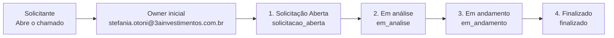

### Solicitação de Compras

- Owner inicial: `stefania.otoni@3ainvestimentos.com.br`
- Quem pode abrir: Lista restrita (40 IDs)
- Campos no formulário: `9`
- Checkpoints de ação: nenhum configurado

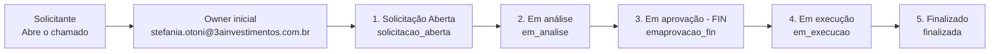

### Solicitação de Suprimentos

- Owner inicial: `stefania.otoni@3ainvestimentos.com.br`
- Quem pode abrir: Lista restrita (35 IDs)
- Campos no formulário: `7`
- Checkpoints de ação: nenhum configurado


## Financeiro

### Solicitação de Pagamentos

- Owner inicial: `pablo.costa@3ariva.com.br`
- Quem pode abrir: Lista restrita (37 IDs)
- Campos no formulário: `0`
- Checkpoints de ação: nenhum configurado
- Alerta: a definição atual não declara campos de formulário (`fields = 0`).

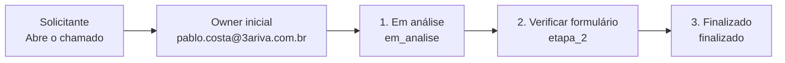

## Gente e Comunicação

### Alteração Cadastral

- Owner inicial: `fernanda.adami@3ainvestimentos.com.br`
- Quem pode abrir: Todos os usuários
- Campos no formulário: `18`
- Checkpoints de ação: nenhum configurado

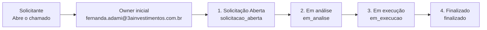

### Alteração de Cargo / Remuneração / Time ou Equipe

- Owner inicial: `fernanda.adami@3ainvestimentos.com.br`
- Quem pode abrir: Lista restrita (38 IDs)
- Campos no formulário: `11`
- Checkpoints de ação: nenhum configurado
- Alerta: o formulário atual tem `field.id = email` duplicado.

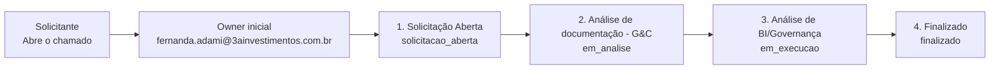

### Análise Pré-Desligamento (Acesso líderes)

- Owner inicial: `barbara@3ainvestimentos.com.br`
- Quem pode abrir: Lista restrita (36 IDs)
- Campos no formulário: `11`
- Checkpoints de ação: `Em análise - BI` -> `Análise BI - Concluída ` (execution, 1 aprovador(es)), `Em análise - Financeiro` -> `Análise Financeiro - Concluída` (execution, 3 aprovador(es)), `Em análise - Jurídico ` -> `Análise Jurídico - Concluída` (execution, 1 aprovador(es)), `Em análise - Governança` -> `Análise Governaça - Concluída` (execution, 1 aprovador(es)), `Re-analise do Jurídico ` -> `Re-Análise Jurídico - Concluída` (execution, 3 aprovador(es)), `Desligamento - Governança` -> `Desligamento - Gov. - Concluído (Avisae áreas)` (acknowledgement, 1 aprovador(es))
- Alerta: o fluxo tem `status.id = em_analise` repetido em várias etapas.

```mermaid
flowchart LR
    wf007_open["Solicitante<br/>Abre o chamado"] --> wf007_owner["Owner inicial<br/>barbara@3ainvestimentos.com.br"]
    wf007_owner --> wf007_s1["1. Iniciar processo de análise<br/>em_analise"]
    wf007_s1 --> wf007_s2["2. Em análise - BI<br/>em_analise"]
    wf007_s2 --> wf007_a2{"Ação: Análise BI - Concluída<br/>execution | 1 aprovador(es)"}
    wf007_a2 --> wf007_s3["3. Em análise - Financeiro<br/>em_analise"]
    wf007_s3 --> wf007_a3{"Ação: Análise Financeiro - Concluída<br/>execution | 3 aprovador(es)"}
    wf007_a3 --> wf007_s4["4. Em análise - Jurídico<br/>em_analise"]
    wf007_s4 --> wf007_a4{"Ação: Análise Jurídico - Concluída<br/>execution | 1 aprovador(es)"}
    wf007_a4 --> wf007_s5["5. Em análise - Governança<br/>em_analise"]
    wf007_s5 --> wf007_a5{"Ação: Análise Governaça - Concluída<br/>execution | 1 aprovador(es)"}
    wf007_a5 --> wf007_s6["6. Re-analise do Jurídico<br/>em_analise"]
    wf007_s6 --> wf007_a6{"Ação: Re-Análise Jurídico - Concluída<br/>execution | 3 aprovador(es)"}
    wf007_a6 --> wf007_s7["7. Desligamento - Governança<br/>etapa_7"]
    wf007_s7 --> wf007_a7{"Ação: Desligamento - Gov. - Concluído (Avisae áreas)<br/>acknowledgement | 1 aprovador(es)"}
    wf007_a7 --> wf007_s8["8. Finalizado<br/>finalizado"]
```

### Cadastro de Novos Entrantes - Associado

- Owner inicial: `fernanda.adami@3ainvestimentos.com.br`
- Quem pode abrir: Lista restrita (33 IDs)
- Campos no formulário: `11`
- Checkpoints de ação: `Enviado ao TI (Acessos)` -> `Ciente - TI` (acknowledgement, 1 aprovador(es)), `Enviado ao Jurídico` -> `Ciente - Jurídico ` (acknowledgement, 3 aprovador(es))

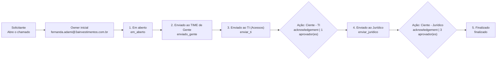

### Cadastro de Novos Entrantes - Demais Áreas

- Owner inicial: `fernanda.adami@3ainvestimentos.com.br`
- Quem pode abrir: Lista restrita (35 IDs)
- Campos no formulário: `10`
- Checkpoints de ação: `Criar acessos/equipamentos - TI` -> `Ciente - TI` (acknowledgement, 1 aprovador(es))

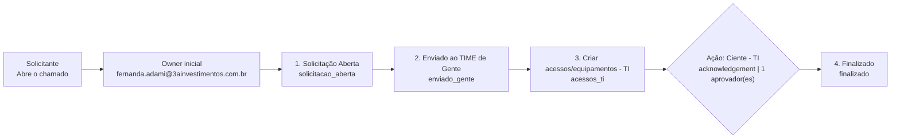

### Comprovação ANCORD

- Owner inicial: `fernanda.adami@3ainvestimentos.com.br`
- Quem pode abrir: Todos os usuários
- Campos no formulário: `6`
- Checkpoints de ação: nenhum configurado

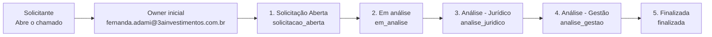

### Fale com a GENTE

- Owner inicial: `fernanda.adami@3ainvestimentos.com.br`
- Quem pode abrir: Todos os usuários
- Campos no formulário: `4`
- Checkpoints de ação: nenhum configurado


### Serviços de Plano de Saúde

- Owner inicial: `fernanda.adami@3ainvestimentos.com.br`
- Quem pode abrir: Todos os usuários
- Campos no formulário: `5`
- Checkpoints de ação: nenhum configurado

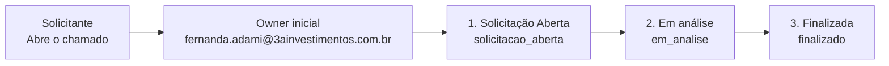

### Solicitação Desligamento - Demais áreas (Não comerciais)

- Owner inicial: `fernanda.adami@3ainvestimentos.com.br`
- Quem pode abrir: Lista restrita (34 IDs)
- Campos no formulário: `12`
- Checkpoints de ação: `Em andamento` -> `Aprovação - Gente` (approval, 1 aprovador(es)), `Desligamento - Gente` -> `Desligamento - Gente` (acknowledgement, 1 aprovador(es)), `Desligamento - TI/FIN` -> `Desligamento - TI` (acknowledgement, 3 aprovador(es)), `Desligamento - BI / Gestão` -> `Desligamento - BI` (acknowledgement, 1 aprovador(es)), `Desligamento - ADM` -> `Desligamento - ADM` (acknowledgement, 1 aprovador(es))

```mermaid
flowchart LR
    wf013_open["Solicitante<br/>Abre o chamado"] --> wf013_owner["Owner inicial<br/>fernanda.adami@3ainvestimentos.com.br"]
    wf013_owner --> wf013_s1["1. Solicitação Aberta<br/>solicitacao_aberta"]
    wf013_s1 --> wf013_s2["2. Em análise<br/>em_analise"]
    wf013_s2 --> wf013_s3["3. Em andamento<br/>em_andamento"]
    wf013_s3 --> wf013_a3{"Ação: Aprovação - Gente<br/>approval | 1 aprovador(es)"}
    wf013_a3 --> wf013_s4["4. Desligamento - Gente<br/>desligamento_gente"]
    wf013_s4 --> wf013_a4{"Ação: Desligamento - Gente<br/>acknowledgement | 1 aprovador(es)"}
    wf013_a4 --> wf013_s5["5. Desligamento - TI/FIN<br/>desligamento_ti"]
    wf013_s5 --> wf013_a5{"Ação: Desligamento - TI<br/>acknowledgement | 3 aprovador(es)"}
    wf013_a5 --> wf013_s6["6. Desligamento - BI / Gestão<br/>desligamento_bi"]
    wf013_s6 --> wf013_a6{"Ação: Desligamento - BI<br/>acknowledgement | 1 aprovador(es)"}
    wf013_a6 --> wf013_s7["7. Desligamento - ADM<br/>enviar_adm"]
    wf013_s7 --> wf013_a7{"Ação: Desligamento - ADM<br/>acknowledgement | 1 aprovador(es)"}
    wf013_a7 --> wf013_s8["8. Finalizado<br/>finalizado"]
```

### Solicitação de Abertura de Vaga

- Owner inicial: `fernanda.adami@3ainvestimentos.com.br`
- Quem pode abrir: Lista restrita (32 IDs)
- Campos no formulário: `5`
- Checkpoints de ação: nenhum configurado


### Solicitação de Férias / Ausência / Compensação de horas

- Owner inicial: `fernanda.adami@3ainvestimentos.com.br`
- Quem pode abrir: Todos os usuários
- Campos no formulário: `7`
- Checkpoints de ação: `Em execução` -> `Ciente - Gente` (acknowledgement, 1 aprovador(es))

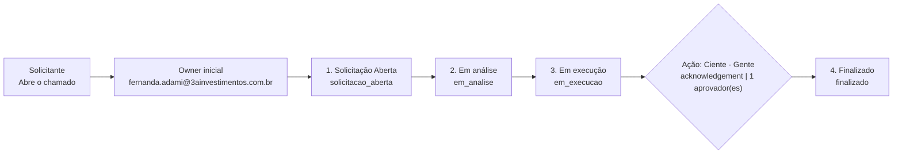

## Governança

### Espelhamento - Caso Único

- Owner inicial: `ti@3ariva.com.br`
- Quem pode abrir: Lista restrita (28 IDs)
- Campos no formulário: `7`
- Checkpoints de ação: nenhum configurado

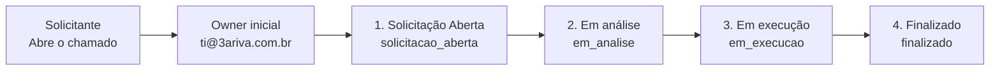

### Espelhamento - Em lote

- Owner inicial: `ti@3ariva.com.br`
- Quem pode abrir: Lista restrita (28 IDs)
- Campos no formulário: `5`
- Checkpoints de ação: nenhum configurado
- Alerta: o formulário atual tem `field.id = email_lider` duplicado.


## Marketing

### Arte / Material gráfico

- Owner inicial: `joao.pompeu@3ainvestimentos.com.br`
- Quem pode abrir: Todos os usuários
- Campos no formulário: `13`
- Checkpoints de ação: nenhum configurado
- Alerta: o formulário atual tem `field.id = imagem_referencia` duplicado.

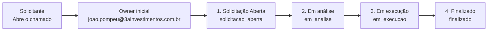

### Assinatura de e-mail; Cartão de visita; Cartão de visita digital

- Owner inicial: `joao.pompeu@3ainvestimentos.com.br`
- Quem pode abrir: Todos os usuários
- Campos no formulário: `9`
- Checkpoints de ação: nenhum configurado


### Ações Marketing

- Owner inicial: `barbara.fiche@3ainvestimentos.com.br`
- Quem pode abrir: Todos os usuários
- Campos no formulário: `5`
- Checkpoints de ação: nenhum configurado

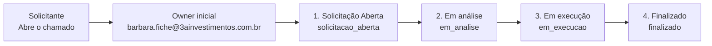

### Evento

- Owner inicial: `barbara.fiche@3ainvestimentos.com.br`
- Quem pode abrir: Todos os usuários
- Campos no formulário: `12`
- Checkpoints de ação: nenhum configurado

```mermaid
flowchart LR
    wf021_open["Solicitante<br/>Abre o chamado"] --> wf021_owner["Owner inicial<br/>barbara.fiche@3ainvestimentos.com.br"]
    wf021_owner --> wf021_s1["1. Solicitação Aberta<br/>solicitacao_aberta"]
    wf021_s1 --> wf021_s2["2. Em análise<br/>em_analise"]
    wf021_s2 --> wf021_s3["3. Em execução<br/>em_execucao"]
    wf021_s3 --> wf021_s4["4. Finalizado<br/>finalizado"]
```

### Revisão de materiais e Apresentações

- Owner inicial: `joao.pompeu@3ainvestimentos.com.br`
- Quem pode abrir: Todos os usuários
- Campos no formulário: `4`
- Checkpoints de ação: nenhum configurado

```mermaid
flowchart LR
    wf022_open["Solicitante<br/>Abre o chamado"] --> wf022_owner["Owner inicial<br/>joao.pompeu@3ainvestimentos.com.br"]
    wf022_owner --> wf022_s1["1. Em aberto<br/>em_aberto"]
    wf022_s1 --> wf022_s2["2. Em análise<br/>em_analise"]
    wf022_s2 --> wf022_s3["3. Finalizado<br/>finalizado"]
```

### Solicitação de Patrocínios

- Owner inicial: `barbara.fiche@3ainvestimentos.com.br`
- Quem pode abrir: Todos os usuários
- Campos no formulário: `10`
- Checkpoints de ação: nenhum configurado

```mermaid
flowchart LR
    wf023_open["Solicitante<br/>Abre o chamado"] --> wf023_owner["Owner inicial<br/>barbara.fiche@3ainvestimentos.com.br"]
    wf023_owner --> wf023_s1["1. Solicitação Aberta<br/>solicitacao_aberta"]
    wf023_s1 --> wf023_s2["2. Em análise<br/>em_analise"]
    wf023_s2 --> wf023_s3["3. Em execução<br/>em_execucao"]
    wf023_s3 --> wf023_s4["4. Finalizado<br/>finalizado"]
```

### Sugestão 3A RIVA Store

- Owner inicial: `barbara.fiche@3ainvestimentos.com.br`
- Quem pode abrir: Todos os usuários
- Campos no formulário: `5`
- Checkpoints de ação: nenhum configurado

```mermaid
flowchart LR
    wf024_open["Solicitante<br/>Abre o chamado"] --> wf024_owner["Owner inicial<br/>barbara.fiche@3ainvestimentos.com.br"]
    wf024_owner --> wf024_s1["1. Solicitação Aberta<br/>solicitacao_aberta"]
    wf024_s1 --> wf024_s2["2. Em análise<br/>em_analise"]
    wf024_s2 --> wf024_s3["3. Em execução<br/>em_execucao"]
    wf024_s3 --> wf024_s4["4. Finalizado<br/>finalizado"]
```

## TI

### Alteração no E-mail XP

- Owner inicial: `ti@3ariva.com.br`
- Quem pode abrir: Todos os usuários
- Campos no formulário: `5`
- Checkpoints de ação: nenhum configurado

```mermaid
flowchart LR
    wf025_open["Solicitante<br/>Abre o chamado"] --> wf025_owner["Owner inicial<br/>ti@3ariva.com.br"]
    wf025_owner --> wf025_s1["1. Solicitação Aberta<br/>solicitacao_aberta"]
    wf025_s1 --> wf025_s2["2. Em análise<br/>em_analise"]
    wf025_s2 --> wf025_s3["3. Em execução<br/>em_execucao"]
    wf025_s3 --> wf025_s4["4. Finalizado<br/>finalizado"]
```

### Padronização de E-mail  - Código XP

- Owner inicial: `ti@3ariva.com.br`
- Quem pode abrir: Todos os usuários
- Campos no formulário: `5`
- Checkpoints de ação: nenhum configurado

```mermaid
flowchart LR
    wf026_open["Solicitante<br/>Abre o chamado"] --> wf026_owner["Owner inicial<br/>ti@3ariva.com.br"]
    wf026_owner --> wf026_s1["1. Solicitação Aberta<br/>solicitacao_aberta"]
    wf026_s1 --> wf026_s2["2. Em análise<br/>em_analise"]
    wf026_s2 --> wf026_s3["3. Em execução<br/>em_execucao"]
    wf026_s3 --> wf026_s4["4. Finalizado<br/>finalizado"]
```

### Problemas de Hardware

- Owner inicial: `ti@3ariva.com.br`
- Quem pode abrir: Todos os usuários
- Campos no formulário: `5`
- Checkpoints de ação: nenhum configurado

```mermaid
flowchart LR
    wf027_open["Solicitante<br/>Abre o chamado"] --> wf027_owner["Owner inicial<br/>ti@3ariva.com.br"]
    wf027_owner --> wf027_s1["1. Solicitação Aberta<br/>solicitacao_aberta"]
    wf027_s1 --> wf027_s2["2. Em análise<br/>em_analise"]
    wf027_s2 --> wf027_s3["3. Em execução<br/>em_execucao"]
    wf027_s3 --> wf027_s4["4. Finalizado<br/>finalizado"]
```

### Problemas de Rede

- Owner inicial: `ti@3ariva.com.br`
- Quem pode abrir: Todos os usuários
- Campos no formulário: `6`
- Checkpoints de ação: nenhum configurado

```mermaid
flowchart LR
    wf028_open["Solicitante<br/>Abre o chamado"] --> wf028_owner["Owner inicial<br/>ti@3ariva.com.br"]
    wf028_owner --> wf028_s1["1. Solicitação Aberta<br/>solicitacao_aberta"]
    wf028_s1 --> wf028_s2["2. Em análise<br/>em_analise"]
    wf028_s2 --> wf028_s3["3. Em execução<br/>em_execucao"]
    wf028_s3 --> wf028_s4["4. Finalizado<br/>finalizado"]
```

### Problemas de Software

- Owner inicial: `ti@3ariva.com.br`
- Quem pode abrir: Todos os usuários
- Campos no formulário: `5`
- Checkpoints de ação: nenhum configurado

```mermaid
flowchart LR
    wf029_open["Solicitante<br/>Abre o chamado"] --> wf029_owner["Owner inicial<br/>ti@3ariva.com.br"]
    wf029_owner --> wf029_s1["1. Solicitação Aberta<br/>solicitacao_aberta"]
    wf029_s1 --> wf029_s2["2. Em análise<br/>em_analise"]
    wf029_s2 --> wf029_s3["3. Em execução<br/>em_execucao"]
    wf029_s3 --> wf029_s4["4. Finalizado<br/>finalizado"]
```

### Reset de Senha

- Owner inicial: `ti@3ariva.com.br`
- Quem pode abrir: Todos os usuários
- Campos no formulário: `4`
- Checkpoints de ação: nenhum configurado
- Alerta: o workflow está ativo, mas não aparece no `workflowOrder` da área TI.

```mermaid
flowchart LR
    wf030_open["Solicitante<br/>Abre o chamado"] --> wf030_owner["Owner inicial<br/>ti@3ariva.com.br"]
    wf030_owner --> wf030_s1["1. Solicitação Aberta<br/>solicitacao_aberta"]
    wf030_s1 --> wf030_s2["2. Em análise<br/>em_analise"]
    wf030_s2 --> wf030_s3["3. Em execução<br/>em_execucao"]
    wf030_s3 --> wf030_s4["4. Finalizado<br/>finalizado"]
```

### Solicitação de Compra - Equipamento

- Owner inicial: `ti@3ariva.com.br`
- Quem pode abrir: Todos os usuários
- Campos no formulário: `6`
- Checkpoints de ação: nenhum configurado
- Alerta: o fluxo tem `status.id = em_execucao` duplicado em duas etapas distintas.

```mermaid
flowchart LR
    wf031_open["Solicitante<br/>Abre o chamado"] --> wf031_owner["Owner inicial<br/>ti@3ariva.com.br"]
    wf031_owner --> wf031_s1["1. Solicitação Aberta<br/>solicitacao_aberta"]
    wf031_s1 --> wf031_s2["2. Em Análise<br/>em_analise"]
    wf031_s2 --> wf031_s3["3. Em aprovação<br/>em_execucao"]
    wf031_s3 --> wf031_s4["4. Em execução<br/>em_execucao"]
    wf031_s4 --> wf031_s5["5. Finalizado<br/>finalizado"]
```

### Solicitação de Compra - Software/Sistema

- Owner inicial: `ti@3ariva.com.br`
- Quem pode abrir: Todos os usuários
- Campos no formulário: `7`
- Checkpoints de ação: nenhum configurado

```mermaid
flowchart LR
    wf032_open["Solicitante<br/>Abre o chamado"] --> wf032_owner["Owner inicial<br/>ti@3ariva.com.br"]
    wf032_owner --> wf032_s1["1. Em Análise<br/>em_analise"]
    wf032_s1 --> wf032_s2["2. Em aprovação<br/>em_aprovacao"]
    wf032_s2 --> wf032_s3["3. Finalizado<br/>finalizado"]
```

### Sugestões 3A RIVA Connect

- Owner inicial: `matheus@3ainvestimentos.com.br`
- Quem pode abrir: Todos os usuários
- Campos no formulário: `4`
- Checkpoints de ação: nenhum configurado

```mermaid
flowchart LR
    wf033_open["Solicitante<br/>Abre o chamado"] --> wf033_owner["Owner inicial<br/>matheus@3ainvestimentos.com.br"]
    wf033_owner --> wf033_s1["1. Solicitação Aberta<br/>solicitacao_aberta"]
    wf033_s1 --> wf033_s2["2. Em Análise<br/>em_analise"]
    wf033_s2 --> wf033_s3["3. Em Andamento<br/>em_andamento"]
    wf033_s3 --> wf033_s4["4. Finalizado<br/>finalizado"]
```
